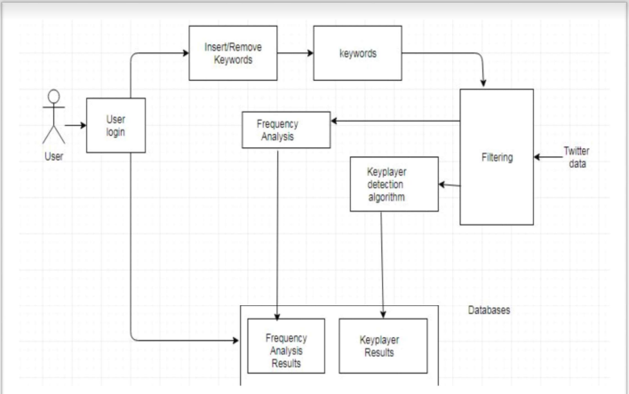

# social-network-analysis

### Problem Statement

Due to the convenience, affordability, and broad reach of social media platforms such as Twitter, It is getting increasingly used to spread hate messages, malicious ideological thoughts, propaganda and activities across the world.

### Proposed Solution
The system that has been developed first stores all the tweets fetched for certain keywords in a file and from there, tweets can be analysed to perform actions like :
- Find key players from the network
- Perform time-frequency analysis and display a graph
- Display heat map of the locations mentioned in the tweets
- Display a graph showing nodes which represent the users and the entire network

### High Level Architecture

  

